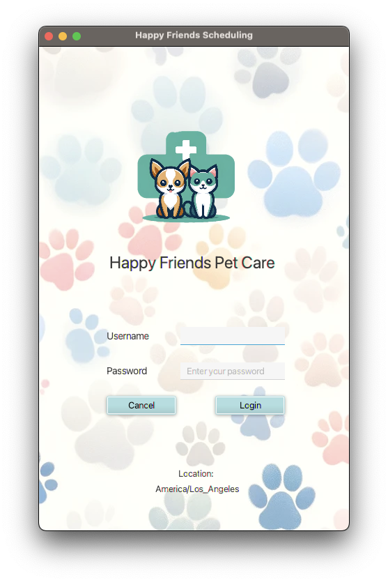

<h1>Title: WGU Capstone C868 - Happy Friends Pet Care Appointment Scheduler</h1>
<h2>Purpose:  
A pet care veterinary appointment scheduling application with the login ability to access
the existing SQL database with functionality 
to add/ update/ delete customers, animals and appointments info with features such as specialize note adding 
and appointment 15 minutes prior reminder.
(Support English/ French language for application alert, a system restart may be required)
</h2>
<ul>
  <li>Author: Bao Tran</li>
  <li>Student ID# 001683938</li>
  <li>Application Version 1.1</li>
  <li>Date: 01/22/2024</li>
  <li>IDE: IntelliJ IDEA 2023.3.2 (Community Edition) x64</li>
  <li>JDK version: Java 17.0.1</li>
  <li>JavaFX version: JAVAFX.SDK.17.0.1</li>
</ul>

<b>INSTRUCTION:<b>  
How to run the program:  
Username: admin  
Password: admin

<h2>LOGIN SCREEN:</h2>

Launch the program, enter username with password (case-sensitive) on the login screen, click the login button, 
or cancel to exit the program.
The system will pop up the alert if the username and/or password are incorrect, then let the user try again.
Once the user has been validated and logged in - an alert will be displayed letting the user know if there are 
any appointments within 15 minutes or not.

<h2>MAIN CUSTOMER MENU:</h2>

After the appointment reminder notification, the user will be directed to the main customer menu where 4 buttons will appear on the screen. 
This will display a table with all the available customer information, it also comes with 3 buttons below (Add, Update, Delete).
The add button will create a new customer, the update button will update an existing customer, 
and the delete button will remove an existing customer from the system.

<h2>ANIMALS:</h2>

The animals button will display all existing animals information by default. This including animal name, type, age, weight...e.g, 
it also comes with 3 buttons below the table (Add Animal, Update Animal, Delete Animal). 
The add button create a new animal profile allow to add note, the update button will update an existing animal profile with three buttons to Edit Note, New Note and Delete Note, and
the delete button will delete the selected animal profile from the system.

<h2>APPOINTMENT:</h2>

The appointment button will display all existing appointments by default. The user can search specific appointment via title, descriptions, vet tech, animal name...e.g
from all appointments. By selecting each radio button on top of the search box, this will provide weekly appointments outlooks, and the
monthly appointments outlooks, it also comes with 3 buttons below the table (Add Appointment, Update Appointment, Delete Appointment). 
The add button create a new appointment, the update button will update an existing appointment, and the delete button will delete the selected appointment from the system.

<h2>REPORTS:</h2>

The report button will display the report list where there will be two tabs on the top of 2 tables. Appointment Totals, and Vet Tech Schedules, each tab will have a different report.
The appointment totals tab displays the different appointment types and their associated totals. On the right side of the appointment totals tab, the appointment totals are broken down by month.
The vet tech schedules tab has a combo box that allows you to select a vet tech and will display appointments associated with the content in the table view.

MySQL Connector Driver Version: mysql-connector-java-8.0.25

